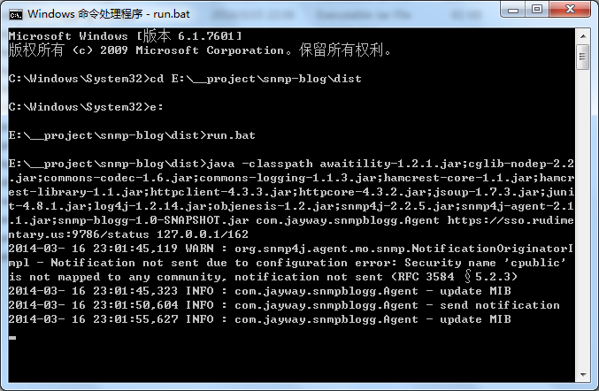
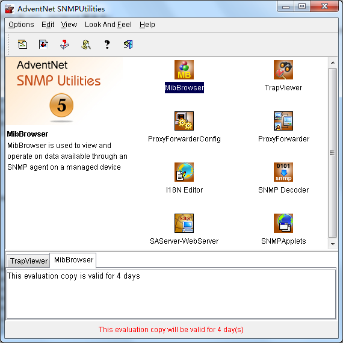
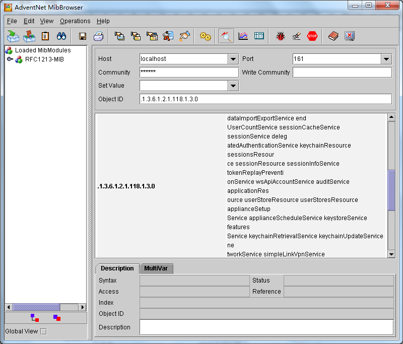
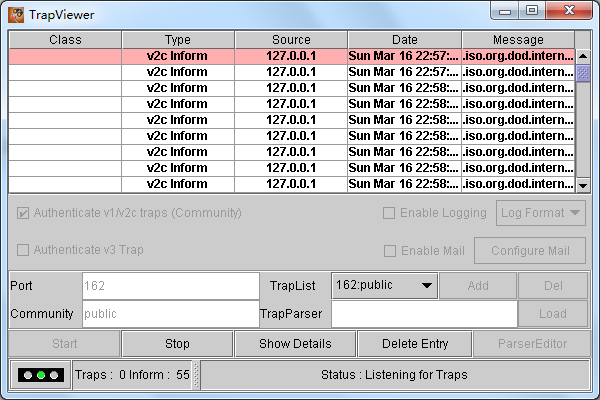
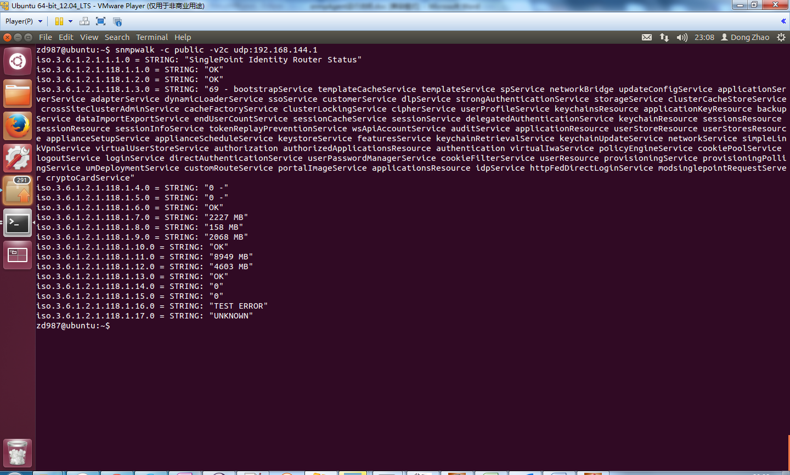
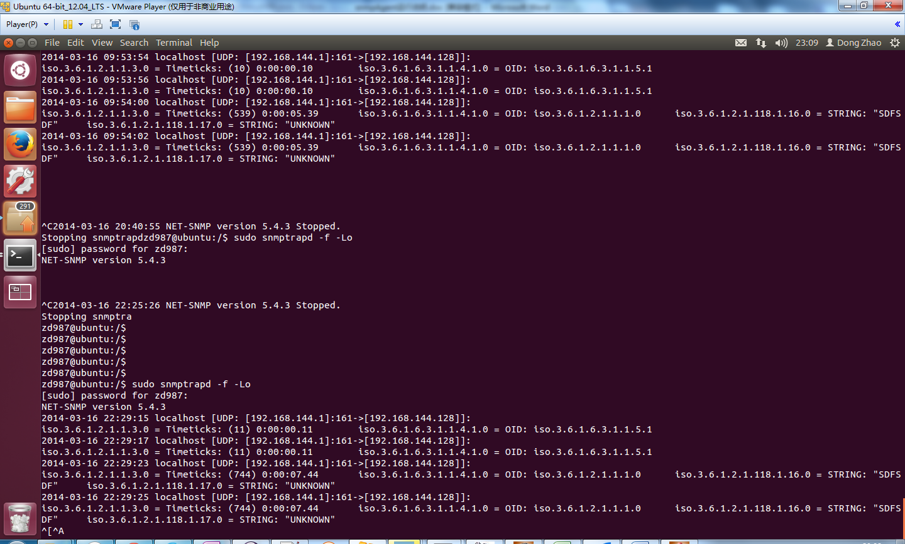
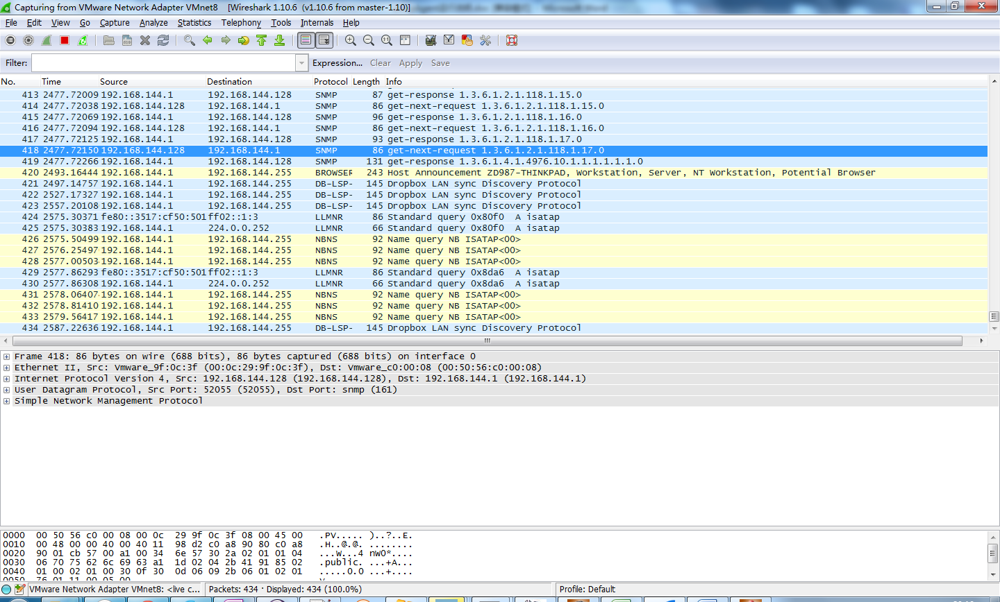
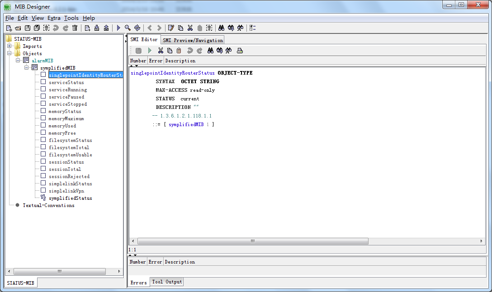
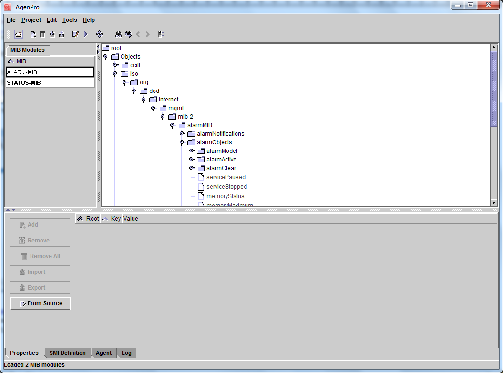

snmp-blog
=========
This is an SNMP Agent demo code forked from https://github.com/jrask/snmp-blog

Mainly derived from open source project [SNMP4J-AGENT]

Quick start of SNMP protocol
----
It is a little difficult for a beginer to develop software with SNMP protocol. It took me quite a lot time to learn what is SNMP, the glossary and how it works. Here are some useful links that can help you learn it easily:

**[Introduction to snmp4j]:** An useful artical teaching you how to write SNMP manager / agent.

**[snmp_tutorial.pdf]:** A very good white-paper that tells you the detailed information about SNMP from the administrator perspective. Here is the [offical link].

**[SNMP中文介绍.pdf]:** An introduction about SNMP protocol in Chinese.

After you get a quick view about SNMP, you can dive into the code and modify its function for your intention.

Environment Setup
----
You can setup the snmp agent / manager by using several existing tools. In my case, I use linux snmp service as the aggent(in vmware as virtual machine), and use *AdventNet SNMP Utilities* (its new version is called [WebNMS SNMP Utilities 5]) in windows as manager. In manager part, I use MIBBrowser to GET the OID value by SNMP, and use Trap Viewer to monitor the TRAP message.

If you wonder how SNMP protocol works, you can check its protocol message content. Here I use [Wireshark] as the network protocol analyzer. Notice that wireshark could not track the message of localhost(127.0.0.1) on windows platform. You can refer to the [workaround].

Design MIB
----
In order to make our own SNMP application, we need to define the MIB. Here I use two commercial tools to help do the work: [MIBDesigner] for visually design the MIB structure information, and [AgenPro] for automatically generate Java code from MIB txt from the first step.

Code Introduction
----
The main class is *com.jayway.snmpblogg.Agent*. It ripped out the SNMPv3 code from BaseAgent and makes it more easy for learning. My use case is to extract the key field value from the predefined servlet status page and exposed as SNMP agent. My code update the original version for several parts:
* Add trap(SNMP v1) / notification(SNMP v2c) message test.
* Add MIB information update mechnism.

Command Run
----
If you want to build a java application that run on the command line, you can refer to the dist\run.bat file. Here you need to add all the required jars in the classpath, and specify the main class.

Snapshots
----
Below are some snapshots for the process:

Run the SNMP Agent in the command line:

 

AdventNet SNMP Utilities Main GUI Page

 

MIBBrowser for GET OID value by SNMP

 

Trap Viewer for SNMP Trap Message Monitor

 

Use linux snmpwalk to view all OID values

 

Use linux snmptrapd to monitor SNMP Trap Message

 

Use Wireshark to do the SNMP network package analyse

 

MIBDesigner to design the MIB information

 

Use AgenPro to auto generate Java code from MIB.txt

 

Hope this can help your SNMP task!

[SNMP4J-AGENT]:http://www.snmp4j.org/
[Wireshark]:http://www.wireshark.org/
[WebNMS SNMP Utilities 5]:http://www.webnms.com/snmputilities/
[Introduction to snmp4j]:http://www.jayway.com/2010/05/21/introduction-to-snmp4j/
[offical link]:http://www.dpstele.com/white-papers/snmp-tutorial/
[snmp_tutorial.pdf]:https://github.com/zd987/snmp-blog/blob/master/doc/snmp_tutorial.pdf
[SNMP中文介绍.pdf]:https://github.com/zd987/snmp-blog/blob/master/doc/SNMP%E4%B8%AD%E6%96%87%E4%BB%8B%E7%BB%8D.pdf
[workaround]:http://wiki.wireshark.org/CaptureSetup/Loopback
[AgenPro]:http://www.agentpp.com/agen/agen.html
[MIBDesigner]:http://www.mibdesigner.com/
